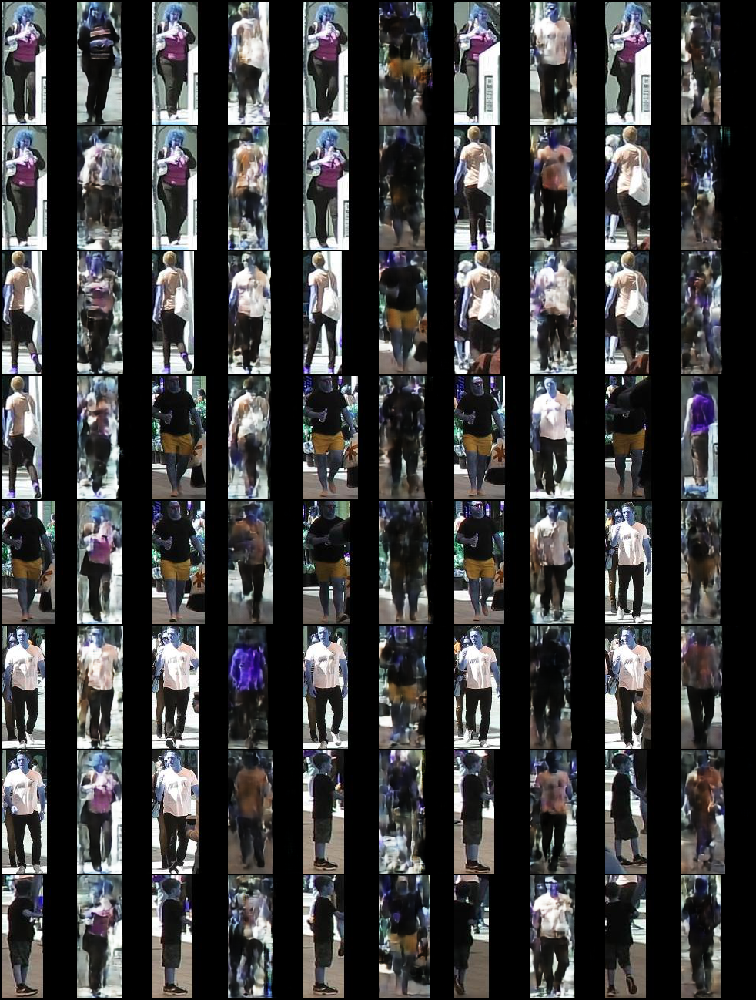

# Catch Transient Objects in a Few Shots

This repository combines two recent deep learning algorithms to do something cool. It shows how to learn transient objects like pedestrian in real time video from a self-driving car. It brings together _Deep SORT_[1], an object segmentation and tracking alogirhtm with the few-shot _Neural Statistician_[2] to create a generator for pedestrian behavior. 


## Dependencies
Code has been tested on

* torch 1.2.0
* numpy 1.16.2
* sklearn 0.20.3
* cv2 (OpenCV) 4.1.0
* PIL 6.1.0
* tqdm 4.32.1


## Installation
```
cd /home/[MyNameHere]
git clone https://github.com/htso/Pedestrian_in_few_shots.git
cd Pedestrian_in_few_shots
git clone https://github.com/nwojke/deep_sort.git
```

## Generate data
I assume you've cloned this github to /home/[MyNameHere]/Pedestrian_in_few_shots

Step 1 : Download MOT16 data from 

         https://motchallenge.net/data/MOT16/

Under heading "_Download_" in middle of page, click "_Download all data (1.9 Gb)_". Put `MOT16.zip` in /home/[MyNameHere]/Pedestrian_in_few_shots/data,

         cd /home/[MyNameHere]/Pedestrian_in_few_shots/data
         unzip MOT16.zip

Step 2 : Download the pre-trained model and detection files as described in Deep SORT's README,

         https://drive.google.com/open?id=18fKzfqnqhqW3s9zwsCbnVJ5XF2JFeqMp

You will get two folders : `detections/`, `networks/`. Place them in /home/[MyNameHere]/Pedestrian_in_few_shots/deep_sort

Step 3 : Pick a video and generate the tracking file. I choose MOT16-03 in deep_sort/test/ folder for illustration; feel free to pick others.

         cd /home/[MyNameHere]/Pedestrian_in_few_shots/deep_sort

         python deep_sort_app.py \
              --sequence_dir=/home/[MyNameHere]/Pedestrian_in_few_shots/data/test/MOT16-03 \
              --detection_file=/home/[MyNameHere]/Pedestrian_in_few_shots/deep_sort/detections/MOT16_POI_test/MOT16-03.npy \
              --display=True \
              --output_file=/home/[MyNameHere]/Pedestrian_in_few_shots/hypotheses.txt \
              --min_confidence=0.8 \
              --min_detection_height=0 \
              --nms_max_overlap=1.0 \
              --max_cosine_distance=0.2         

This will create a file `hypotheses.txt` in /home/[MyNameHere]/Pedestrian_in_few_shots.

Step 4 : Run generate_MOT_dat.py,

         cd /home/[MyNameHere]/Pedestrian_in_few_shots

         python generate_MOT_data.py \
              --the_video=MOT16-03 \
              --detection_file=/home/[MyNameHere]/Pedestrian_in_few_shots/deep_sort/hypotheses.txt \
              --video_dir=/home/[MyNameHere]/Pedestrian_in_few_shots/data/test \
              --out_dir= /home/[MyNameHere]/Pedestrian_in_few_shots/data \
              --max_height=160 \
              --max_width=96 

This will create a directory structure in data/ as follow,

```
                                            data
                                             |
             -----------------------------------------------------------------
             |                          |                                    |
          PERSON1                   PERSON2            ....              PERSON169
             |                          |                                    |
           VIDEO                      VIDEO                                VIDEO
             |                          |                                    | 
        P103Fr309.jpg              P107Fr336.jpg                       P159Fr517.jpg
        P103Fr310.jpg              P107Fr337.jpg                       P159Fr518.jpg
            ...                       ....                                  ...
```

## Run Experiment

Edit the parameters in runMe.sh, then

```
cd /home/[MyNameHere]/Pedestrian_in_few_shots
bash runMe.sh
```

## Results



## Acknowledgements
Special thanks to https://github.com/conormdurkan for his implementation[3] of the Neural Statistician paper from which this repo draws heavily.


## References

[1] Wojke, N., Bewley, A., & Paulus, D. (2017, September). Simple online and realtime tracking with a deep association metric. In 2017 IEEE International Conference on Image Processing (ICIP) (pp. 3645-3649). IEEE.

[2] Edwards, H., & Storkey, A. (2016). Towards a neural statistician. arXiv preprint [arXiv:1606.02185](https://arxiv.org/pdf/1606.02185.pdf)

[3] https://github.com/conormdurkan/neural-statistician

[4] https://github.com/nwojke/deep_sort.git

  